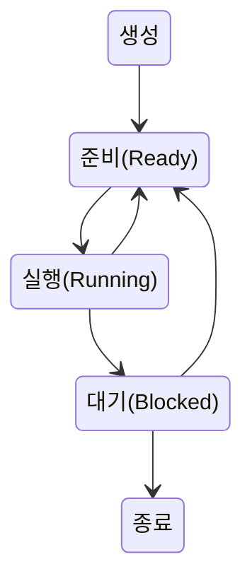

# 프로세스의 이해

프로세스는 실행된 프로그램
컴퓨터 내에 리소스를 사용 및 관리 시작

프로세스 구조
코드, 데이터, 스택, 힙
코드: 명령어
데이터: 전역 변수
스택: 지역 변수
힙: 동적 메모리

# 프로세스 상태
CPU는 한번에 하나의 연산만 가능
여러개의 프로세스가 있으면 번갈아가며 실행한다.

`프로세스 컨트롤 블록`
프로세스ID, 레지스터 데이터, 스케줄링 정보, 상태등이 등록된다

