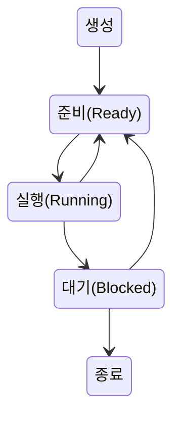

# 프로세스의 이해
프로세스는 실행된 프로그램
컴퓨터 내에 리소스를 사용 및 관리 시작

프로세스 구조
코드, 데이터, 스택, 힙
코드: 명령어
데이터: 전역 변수
스택: 지역 변수
힙: 동적 메모리

# 프로세스 상태
CPU는 한번에 하나의 연산만 가능
여러개의 프로세스가 있으면 번갈아가며 실행한다.

`프로세스 컨트롤 블록`
프로세스ID, 레지스터 데이터, 스케줄링 정보, 상태등이 등록된다

프로세스는 실행중에 프로세스를 생성하기도 하며 생성된 프로세스는 자식 프로세스로 부른다
각각의 프로세스는 `독립적인 영역`을 가진다

# 컨텍스트 스위칭
여러개의 프로세스가 있을 때 컨텍스트 스위칭을 하여
동시에 운영되는 것 처럼 보이는 것을 멀티 프로세스 운영체제라 함
메모리와 레지스터의 데이터를 바꾸며 실행

부가 내용 `컨텍스트`
개발에서 사용하는 컨텍스트는 해당 상황이나 시점, 해당 페이지에 필요한 데이터를 이야기하는 경우가 많음

# 프로세스 생성
프로세스는 1번만 실행되며 이후에는 최초의 프로세스를 복사하여 만들어진다
이유는 새로 생성하는 것 보다 효율이 좋기에

# 스레드
`Thread`
프로세스내의 구성
스레드는 지역변수가 담기는 스택 영역은 각각 가지고 그외는 공유
프로세스는 독립적이나 스레드는 많은 부분을 공유받음
프로세스가 프로그램이면 스레드는 그 안에서 일어나는 세세한 작업으로 볼 수 있음

# CPU 스케줄링
어떤 프로세스를 돌릴지, 얼마나 돌릴지
우선순위에 따라 더 우선적으로 많이 돌아감

`알고리즘`
부하 최소화, 리소스 효율적 분배, 대기와 응답시간이 길지 않을 것 등
주의 '기아'상태(평생 사용이 못되는 상태)

Queue 선입선출
우선순위 스케줄링